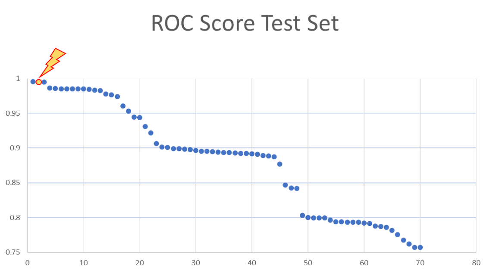

# DataChallenge Machine Learning 1  

Ce data challenge a été organisé pour évaluer les connaissances des étudiants des mastères spécialisés IA et Big Data 2020 /2021 pour l'enseignement introductif au machine learning. Le notebook soumis est consultable [ici](https://github.com/PhileasFrog/DataChallenge_ML/blob/main/notebook/Data_Challenge_Jeancler_D.ipynb). 

Mon classement à l'issue de challenge est de 2/71 avec un ROC 0.995 (très suspect !?). Précisons d'entrée que l'exercice a été biaisé par la nature des données d'entrée et que les résultats relèvent plus d'astuce que de réelles perforamances de machine learning. 

 

# Enoncé : Supervised anomaly detection

**Anomaly detection** (or **outlier detection**) comprises the **machine learning** methods aimed at identification of observations that exhibit suspicious behaviour and are very likely to cause a problem. 

This data set is provided by X, one of the largest Original Equipment Manufacturer. It regards the task of the supervised anomaly detection on a production line. For each of the produced items, a set of properties are measured, and finally a special testing procedure verifies that the item is intact. Thus, all the observations are labeled as normal or defect (anomalies), with anomalies being rare.

Statistically, this is formalized as the supervised anomaly detection, because the correct labels are given during training. This can also be seen as a task of supervised classification with two very dis-equilibrated classes.

You are suggested to construct an anomaly detection rule which, for each new observation, provides an anomaly score, that is the score is higher for more abnormal observation. This would allow to detect anomaly just based on measured parameters of the item without running a mechanical testing procedure.

## The performance criterion:

You should submit a file that contains in each row anomaly score (a real vaule) for the observation in the corresponding row of the file **xtest.csv**. For a sample submission please see the code below. Please note, that your score should provide ordering which allows to identify anomalies, i.e., the higher the value of the score, the **more abnormal** the observation should be considered.

The performance criterion is the **Area Under the Receiver Operating Characteristic** (AUC), see also:
https://en.wikipedia.org/wiki/Receiver_operating_characteristic#Area_under_the_curve
